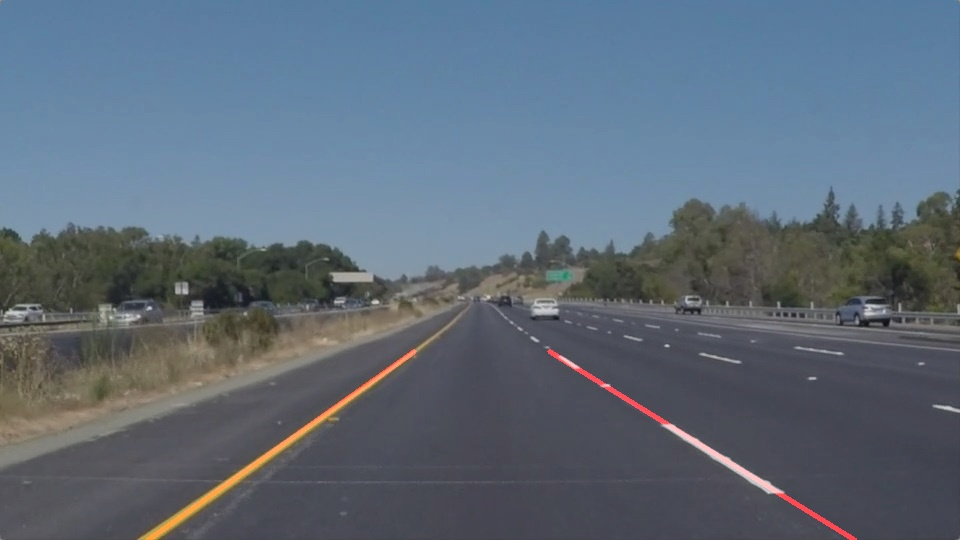

# **Finding Lane Lines on the Road** 

This file discusses my implementation of the pipeline to find the lane lines on road.


## Reflection


###  Pipeline of drawing lines
---

I have first implemented the pipeline as an abstract to draw semgemented lines, and then as a next step averaged and extrapolated to draw two straight lane lines (left and right). I have implemented this pipeline as a function **drawLinesPipeline()**. The function is perameterized, such that all the parameters to the various sub-functions in the pipline could be passed in as paremeters. 

Syntax:  
**linedImage =  drawLinesPipeline(image, cannyKernelSize, cannyLowThresh, cannyHighThresh, maskVertices, 
                      houghRho, houghTheta, houghThreshold, houghMinLineLength, houghMaxLineGap)**


```python
def drawLinesPipeline(Image, CannyKernelSize, CannyLowThresh, CannyHighThresh, MaskVertices, 
                      HoughRho, HoughTheta, HoughThreshold, HoughMinLineLength, HoughMaxLineGap):
    # Create two copies of the image - one for actual image, one for superimposing the lines
    colorImage = np.copy(Image)
    lineImage = np.copy(Image)
    
    # Filtering white and yellow color in the image
    colorSelectedImg = select_rgb_white_yellow(lineImage)

    # Converting into Grayscale
    grayImg = grayscale(colorSelectedImg)

    # Define a kernel size and apply Gaussian smoothing
    smoothImg = gaussian_blur(grayImg, CannyKernelSize)

    # Define Canny parameters and apply on the image
    edgesImg = canny(smoothImg, CannyLowThresh, CannyHighThresh)

    # Mask the region of interest in the 'edgesImg'
    maskedImg = region_of_interest(edgesImg, MaskVertices)

    # Define Hough parameters and apply to the 'maskedImg'
    houghImg = hough_lines(maskedImg, HoughRho, HoughTheta, HoughThreshold, HoughMinLineLength, HoughMaxLineGap)
    
    # Superimpose line image ('houghImg') and the 'colorImage'
    finalImg = weighted_img(houghImg, colorImage, α=0.8, β=1., γ=0.)
    return finalImg
```

[//]: # (Image References)

Following are the steps in the pipeline:

**1. Read the image from the input**  

  

Create two copies of the image, one to mask and draw the lines (line image), and one the original image itself to superimpose the line image.


**2. Convert the image to grayscale**  

  


**3. Smooth the image using the Gaussian smoothing**  

The parameter cannyKernelSize=5 defines the window for averaging the pixels.  
 
  


**4. Find the edge features using canny edge detection**  

Parameters used here are: 

    cannyLowThresh = 50  
    cannyHighThresh = 150,  

since it is recommended to set the low:high threshold ratio as 1:3.

  


**5.  Mask the image to a quadrilateral, given the vertices of the quadrilateral**  

I have defined a reasonable mask of the shape of a quadrilateral and used these as vertices to be masked. The vertices are represented as a fraction of the size of the image.  
    
  


**6. Find the lines using hough transform, and draw them**  

The following are the hough parameters, passed to the pipeline function:

    houghRho = 1              # distance resolution in pixels of the Hough grid
    houghTheta = np.pi/180    # angular resolution in radians of the Hough grid
    houghThreshold = 20       # minimum number of votes (intersections in Hough grid cell)
    houghMinLineLength = 20   # minimum number of pixels making up a line
    houghMaxLineGap = 320     # maximum gap in pixels between connectable line segments  
    
  


**7. Superimpose the line image and the color image**  

Using the function cv2.addWeighted(), the images are superimposed on one another.
    
  


###  Averaging slope and extrapolating points
---

Here, the function draw_lines() has to be modified, such that the function draws only two continuous solid lines on the left and right side, representing the lane lines. 
    
Based on the slope of the lines, the lines are classified as left of right lines. Negative slope represents left line, because the co-ordinates in image plane are flipped. Similarly, positive slope represents right line. Along with this, the length of the lines, and the intercept of the lines on the Y-axis are calculated based on the euclidean line length formula. 
    
Based on this classification, the average slope and average intercept is calculated, giving more weightage to longer lines. Once the left slopes and intercepts of the left and right lines are calculated, the lines are drawn using the cv2.line() function. The result is as follows:




##  Potential shortcomings with my current pipeline


I could not succeed the optional "Challenge.mp4" video. The cause of this is that, there are strong edges on the road-divider pavement regions, which are also considered as potential lines for the lanes. 


## Suggestions to possibly improve my pipeline

A possible improvement is to apply a color filter before converting the image into grayscale, which identifies the yellow and white pixels in the image and mask out the other regions. This has to be done by first converting the image into HSV or HSL colo space, since the effect of shadows on colors can be handled well in those color spaces.

